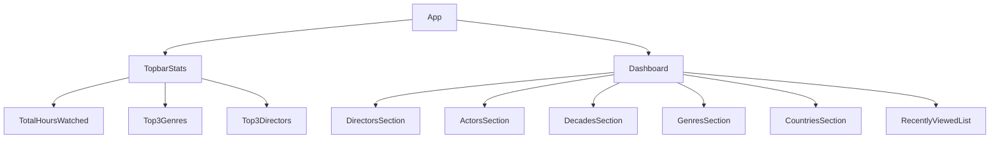

# Statarr Project Brandspace and Design Requirements

## Project Component Structure

## Design Requirements

### General
- Clean, modern, and spacious layout.
- Responsive design using CSS Grid and Flexbox.
- Consistent use of colors, fonts, and spacing.
- Use of cards/panels with subtle shadows and rounded corners.
- Smooth animations and transitions for interactivity.

### TopbarStats
- Displays yearly statistics prominently.
- Includes total hours watched, top 3 genres, and top 3 directors.
- Horizontal layout with clear typography and icons.

### Dashboard Sections
- Always visible sections: Directors, Actors, Decades, Genres, Countries.
- Each section presented as a card or panel.
- Use charts, progress bars, or lists to visualize data.
- Recently Viewed list displayed below data sections.
- Interactive elements for sorting or filtering (future scope).

### UI Stack
- React for component-based architecture.
- Tailwind CSS for utility-first styling.
- Chakra UI for accessible, customizable React components.
- Charting libraries to be integrated for data visualization.
- Animations and transitions for smooth user experience.

### Accessibility
- Ensure keyboard navigability.
- Use semantic HTML and ARIA attributes.
- Maintain sufficient color contrast.

---

This document serves as the formal design and brandspace guide for the Statarr project UI upgrade.